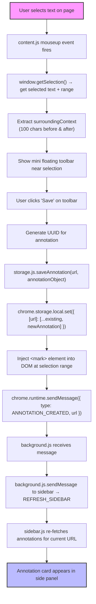
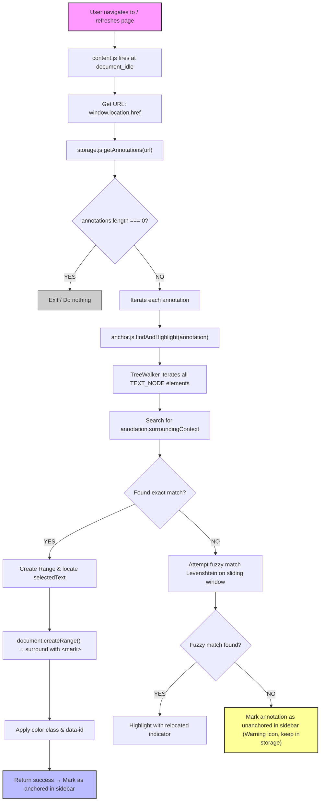
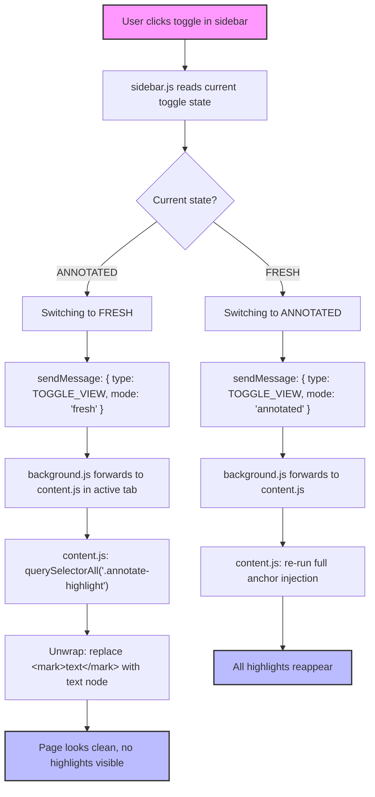
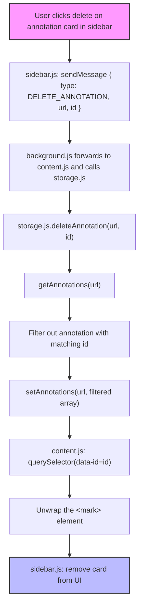

# Control Flow Diagrams

This document outlines the four key control flows within the AnnotateX Chrome Extension:
1. **User Creates a New Annotation**
2. **Page Load — Re-injection of Saved Highlights**
3. **Toggle — Fresh View / Annotated View**
4. **Delete Annotation**

---

## Flow 1: User Creates a New Annotation

### Visual Sequence


### Text Flow
```
User selects text on page
        │
        ▼
content.js mouseup event fires
        │
        ▼
window.getSelection() → get selected text + range
        │
        ▼
Extract surroundingContext (100 chars before + after)
        │
        ▼
Show mini floating toolbar near selection
        │
        ▼
User clicks "Save" on toolbar
        │
        ▼
Generate UUID for annotation
        │
        ▼
storage.js.saveAnnotation(url, annotationObject)
        │
        ▼
chrome.storage.local.set({ [url]: [...existing, newAnnotation] })
        │
        ▼
Inject <mark> element into DOM at selection range
        │
        ▼
chrome.runtime.sendMessage({ type: ANNOTATION_CREATED, url })
        │
        ▼
background.js receives message
        │
        ▼
background.js.sendMessage to sidebar → REFRESH_SIDEBAR
        │
        ▼
sidebar.js re-fetches annotations for current URL
        │
        ▼
Annotation card appears in side panel
```

---

## Flow 2: Page Load — Re-injection of Saved Highlights

### Visual Sequence


### Text Flow
```
User navigates to / refreshes any page
        │
        ▼
content.js fires at document_idle
        │
        ▼
Get current URL: window.location.href
        │
        ▼
storage.js.getAnnotations(url) → returns array of annotations
        │
        ▼
annotations.length === 0?
    YES → exit, do nothing
    NO  → continue
        │
        ▼
For each annotation in array:
        │
        ▼
  anchor.js.findAndHighlight(annotation)
        │
        ▼
  TreeWalker iterates all TEXT_NODE elements
        │
        ▼
  Search for annotation.surroundingContext in text content
        │
        ├── FOUND (exact match)
        │       │
        │       ▼
        │   Create Range, locate selectedText within context
        │       │
        │       ▼
        │   document.createRange() → surround with <mark>
        │       │
        │       ▼
        │   Apply color class, attach data-id attribute
        │       │
        │       ▼
        │   Return success → mark as anchored in sidebar
        │
        └── NOT FOUND (exact match fails)
                │
                ▼
            Attempt fuzzy match (Levenshtein on sliding window)
                │
                ├── Fuzzy match found → highlight with "relocated" indicator
                │
                └── No match → mark annotation as "unanchored" in sidebar
                              (show warning icon, keep annotation in storage)
```

---

## Flow 3: Toggle — Fresh View / Annotated View

### Visual Sequence


### Text Flow
```
User clicks toggle in sidebar
        │
        ▼
sidebar.js reads current toggle state
        │
        ├── Current: ANNOTATED → switching to FRESH
        │       │
        │       ▼
        │   sendMessage: { type: TOGGLE_VIEW, mode: 'fresh' }
        │       │
        │       ▼
        │   background.js forwards to content.js in active tab
        │       │
        │       ▼
        │   content.js: document.querySelectorAll('.annotate-highlight')
        │       │
        │       ▼
        │   For each mark: unwrap — replace <mark>text</mark> with text node
        │       │
        │       ▼
        │   Page looks clean, no highlights visible
        │
        └── Current: FRESH → switching to ANNOTATED
                │
                ▼
            sendMessage: { type: TOGGLE_VIEW, mode: 'annotated' }
                │
                ▼
            content.js: re-run full anchor injection (same as Flow 2)
                │
                ▼
            All highlights reappear
```

---

## Flow 4: Delete Annotation

### Visual Sequence


### Text Flow
```
User clicks delete on annotation card in sidebar
        │
        ▼
sidebar.js: sendMessage { type: DELETE_ANNOTATION, url, id }
        │
        ▼
background.js forwards to content.js and calls storage.js
        │
        ▼
storage.js.deleteAnnotation(url, id):
    - getAnnotations(url)
    - filter out annotation with matching id
    - setAnnotations(url, filtered array)
        │
        ▼
content.js: document.querySelector(`[data-id="${id}"]`)
    - unwrap the <mark> element
        │
        ▼
sidebar.js: remove card from UI
```
