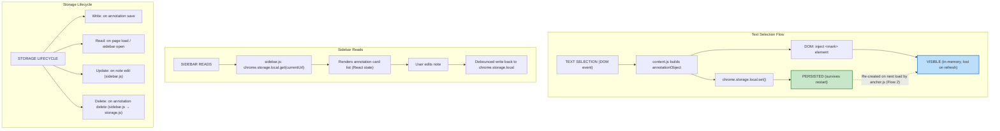

# 5. Data Flow and Storage Design

## 5.1 Data Model

Every annotation is one object:

```javascript
{
  id: "uuid-v4-string",              // unique identifier
  url: "https://docs.spring.io/...", // full page URL (also the storage key)
  selectedText: "BeanFactory is the root interface",
  surroundingContext: "...the container itself. BeanFactory is the root interface for accessing a Spring bean container...",
  note: "Parent of ApplicationContext — remember this for interview",
  color: "yellow",                   // yellow | green | blue | pink
  timestamp: "2026-06-06T10:30:00Z",
  anchored: true                     // false if re-injection failed
}
```

---

## 5.2 Storage Schema

`chrome.storage.local` stores a flat key-value map. Each key is a full URL. Each value is an array of annotation objects.

```javascript
{
  "https://docs.spring.io/spring-framework/docs/current/": [
    { id: "abc123", selectedText: "...", ... },
    { id: "def456", selectedText: "...", ... }
  ],
  "https://developer.mozilla.org/en-US/docs/Web/API/Fetch": [
    { id: "ghi789", selectedText: "...", ... }
  ],
  "_annotatedUrls": ["https://docs.spring.io/...", "https://developer.mozilla.org/..."]
}
```

> [!IMPORTANT]
> The `_annotatedUrls` key is a separate index — an array of all URLs that have at least one annotation. It is updated on every save and delete. This avoids scanning all storage keys to build the "Annotated Pages" list in the sidebar.

---

## 5.3 Data Flow Diagram

### Visual Flow



### Text Flow

```
TEXT SELECTION (DOM event)
        │
        ▼
content.js builds annotationObject
        │
        ├──► chrome.storage.local.set()  ──► PERSISTED (survives restart)
        │
        └──► DOM: inject <mark> element  ──► VISIBLE (in-memory, lost on refresh)
                                                     │
                                              Re-created from storage on next load
                                              by anchor.js (Flow 2)


SIDEBAR READS
        │
        ▼
sidebar.js: chrome.storage.local.get(currentUrl)
        │
        ▼
Renders annotation card list (React state)
        │
        ▼
User edits note → debounced write back to chrome.storage.local


STORAGE LIFECYCLE
        │
        ├── Write: on annotation save
        ├── Read: on page load (content.js), on sidebar open (sidebar.js)
        ├── Update: on note edit (sidebar.js)
        └── Delete: on annotation delete (sidebar.js → storage.js)
```

---

## 5.4 Storage Size Estimation

| Metric | Value | Notes |
| :--- | :--- | :--- |
| Average annotation object size | ~500 bytes | text + context + note + metadata |
| Per URL limit | 8KB | ≈ 16 annotations per URL key |
| Total storage | 10MB | ≈ 20,000 annotations before hitting limits |

> [!NOTE]
> For a personal tool reading documentation, this is practically unlimited.
