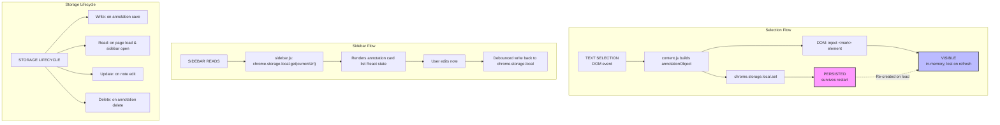

# Data Flow, Storage Design, Complexity Analysis, and Implementation Guide

## 5. DATA FLOW AND STORAGE DESIGN

### 5.1 Data Model
Every annotation is represented by a single object:
```javascript
{
  id: "uuid-v4-string",              // unique identifier
  url: "https://docs.spring.io/...", // full page URL (also the storage key)
  selectedText: "BeanFactory is the root interface",
  surroundingContext: "...the container itself. BeanFactory is the root interface for accessing a Spring bean container...",
  note: "Parent of ApplicationContext — remember this for interview",
  color: "yellow",                   // yellow | green | blue | pink
  timestamp: "2026-06-06T10:30:00Z",
  anchored: true                     // false if re-injection failed
}
```

### 5.2 Storage Schema
`chrome.storage.local` stores a flat key-value map. Each key is a full URL. Each value is an array of annotation objects.
```javascript
{
  "https://docs.spring.io/spring-framework/docs/current/": [
    { "id": "abc123", "selectedText": "...", ... },
    { "id": "def456", "selectedText": "...", ... }
  ],
  "https://developer.mozilla.org/en-US/docs/Web/API/Fetch": [
    { "id": "ghi789", "selectedText": "...", ... }
  ],
  "_annotatedUrls": ["https://docs.spring.io/...", "https://developer.mozilla.org/..."]
}
```
The `_annotatedUrls` key is a separate index — an array of all URLs that have at least one annotation. It is updated on every save and delete. This avoids scanning all storage keys to build the "Annotated Pages" list in the sidebar.

### 5.3 Data Flow Diagram

#### Visual Flow


#### Text Flow
```
TEXT SELECTION (DOM event)
        │
        ▼
content.js builds annotationObject
        │
        ├──► chrome.storage.local.set()  ──► PERSISTED (survives restart)
        │
        └──► DOM: inject <mark> element  ──► VISIBLE (in-memory, lost on refresh)
                                                     │
                                              Re-created from storage on next load
                                              by anchor.js (Flow 2)


SIDEBAR READS
        │
        ▼
sidebar.js: chrome.storage.local.get(currentUrl)
        │
        ▼
Renders annotation card list (React state)
        │
        ▼
User edits note → debounced write back to chrome.storage.local


STORAGE LIFECYCLE
        │
        ├── Write: on annotation save
        ├── Read: on page load (content.js), on sidebar open (sidebar.js)
        ├── Update: on note edit (sidebar.js)
        └── Delete: on annotation delete (sidebar.js → storage.js)
```

### 5.4 Storage Size Estimation
- **Average annotation object size**: ~500 bytes (text + context + note + metadata)
- **Per URL limit**: 8KB → approximately 16 annotations per URL key
- **Total storage**: 10MB → approximately 20,000 annotations before hitting limits
For a personal tool reading documentation, this is practically unlimited.

---

## 6. COMPLEXITY ANALYSIS

### 6.1 `anchor.js` — `findAndHighlight()`
This is the most computationally significant function in the entire extension.
#### Algorithm:
1. **TreeWalker traversal**: $O(N)$ where $N$ = number of text nodes in the DOM.
2. **String concatenation of all text nodes**: $O(N \times \text{avg\_node\_length})$.
3. **Exact search for surroundingContext**: $O(N \times M)$ where $M$ = length of context string (JavaScript `String.indexOf` uses Boyer-Moore-Horspool internally → average $O(N)$).
4. **Range creation and DOM wrapping**: $O(1)$ once the node is found.

**Overall**: $O(N \times M)$ worst case, effectively $O(N)$ on average due to JS engine's string search optimization.
For a typical documentation page: $N \approx 500\text{--}2000$ text nodes, $M \approx 200$ chars. Executes in under 10ms per annotation.
For $K$ annotations on one page: $O(K \times N \times M)$ — linear in number of annotations.

### 6.2 Fuzzy Match Fallback — Levenshtein on Sliding Window
Used only when exact context match fails.
- Window size $W = \text{surroundingContext.length}$
- Slide over text of length $T$
- Each window comparison: $O(W^2)$ — standard Levenshtein DP
- **Overall**: $O(T \times W^2)$

This is expensive. Mitigations:
- Only runs when exact match fails (rare case)
- Cap $W$ at 200 characters
- Abort early if first 20 chars don't match at all (heuristic pre-filter)

**Practical performance**: < 50ms on modern hardware even for long pages.

### 6.3 Storage Operations
| Operation | Complexity | Details |
| :--- | :--- | :--- |
| `getAnnotations(url)` | $O(1)$ | Direct key lookup in chrome.storage |
| `saveAnnotation(url, obj)` | $O(K)$ | Read array of K annotations, append, write back |
| `deleteAnnotation(url, id)` | $O(K)$ | Read array, filter by id, write back |
| `getAllAnnotatedUrls()` | $O(1)$ | Direct key lookup on `_annotatedUrls` index |

### 6.4 DOM Injection (Re-injection on page load)
For $K$ annotations:
- $K \times \text{TreeWalker traversal}$: $O(K \times N)$
- $K \times \text{Range creation}$: $O(K)$
- $K \times \text{DOM mutation}$: $O(K)$
- **Total**: $O(K \times N)$

This runs at `document_idle` (after page is loaded), so it does not block the initial render. For $K = 20$ annotations and $N = 1000$ text nodes, this is 20,000 operations — under 5ms in practice.

### 6.5 Toggle (Fresh → Annotated or Annotated → Fresh)
- **Fresh View** (remove highlights):
  - `querySelectorAll('.annotate-highlight')` → $O(K)$
  - For each: unwrap DOM node → $O(1)$
  - Total: $O(K)$
- **Annotated View** (re-inject):
  - Same as page load re-injection: $O(K \times N)$

### 6.6 Space Complexity
| Component | Space Complexity | Details |
| :--- | :--- | :--- |
| In-memory DOM marks (per page) | $O(K)$ | $K$ injected mark elements |
| `chrome.storage.local` | $O(U \times K)$ | $U$ = annotated URLs, $K$ = annotations per URL |
| Sidebar React state | $O(K)$ | Annotation list for current URL |
| TreeWalker traversal | $O(N)$ | Text node array built during search |

---

## 7. IMPLEMENTATION GUIDE (Copy-Paste Ready for Antigravity)

### 7.1 `manifest.json`
```json
{
  "manifest_version": 3,
  "name": "AnnotateX",
  "version": "1.0.0",
  "description": "Persistent annotations on any webpage. Highlights survive refresh.",
  "permissions": [
    "storage",
    "activeTab",
    "scripting",
    "sidePanel",
    "history"
  ],
  "host_permissions": [
    "https://*/*",
    "http://*/*"
  ],
  "background": {
    "service_worker": "background.js"
  },
  "content_scripts": [
    {
      "matches": ["https://*/*", "http://*/*"],
      "js": ["content.js"],
      "css": ["styles/highlights.css"],
      "run_at": "document_idle"
    }
  ],
  "side_panel": {
    "default_path": "sidebar/sidebar.html"
  },
  "action": {
    "default_icon": {
      "16": "assets/icon16.png",
      "48": "assets/icon48.png",
      "128": "assets/icon128.png"
    }
  },
  "icons": {
    "16": "assets/icon16.png",
    "48": "assets/icon48.png",
    "128": "assets/icon128.png"
  }
}
```

### 7.2 `utils/storage.js`
```javascript
const URLS_INDEX_KEY = '_annotatedUrls';

async function getAnnotations(url) {
  return new Promise((resolve) => {
    chrome.storage.local.get([url], (result) => {
      resolve(result[url] || []);
    });
  });
}

async function saveAnnotation(url, annotation) {
  const existing = await getAnnotations(url);
  const updated = [...existing, annotation];
  await new Promise((resolve) => {
    chrome.storage.local.set({ [url]: updated }, resolve);
  });
  await addToUrlIndex(url);
}

async function updateAnnotationNote(url, id, newNote) {
  const existing = await getAnnotations(url);
  const updated = existing.map(a => a.id === id ? { ...a, note: newNote } : a);
  await new Promise((resolve) => {
    chrome.storage.local.set({ [url]: updated }, resolve);
  });
}

async function deleteAnnotation(url, id) {
  const existing = await getAnnotations(url);
  const updated = existing.filter(a => a.id !== id);
  if (updated.length === 0) {
    await new Promise((resolve) => {
      chrome.storage.local.remove(url, resolve);
    });
    await removeFromUrlIndex(url);
  } else {
    await new Promise((resolve) => {
      chrome.storage.local.set({ [url]: updated }, resolve);
    });
  }
}

async function getAllAnnotatedUrls() {
  return new Promise((resolve) => {
    chrome.storage.local.get([URLS_INDEX_KEY], (result) => {
      resolve(result[URLS_INDEX_KEY] || []);
    });
  });
}

async function addToUrlIndex(url) {
  const urls = await getAllAnnotatedUrls();
  if (!urls.includes(url)) {
    await new Promise((resolve) => {
      chrome.storage.local.set({ [URLS_INDEX_KEY]: [...urls, url] }, resolve);
    });
  }
}

async function removeFromUrlIndex(url) {
  const urls = await getAllAnnotatedUrls();
  const updated = urls.filter(u => u !== url);
  await new Promise((resolve) => {
    chrome.storage.local.set({ [URLS_INDEX_KEY]: updated }, resolve);
  });
}

// Export for use in content.js and sidebar.js
// In content.js (no module support): copy-paste these functions directly
// In sidebar.js (bundled): use ES module exports below
if (typeof module !== 'undefined') {
  module.exports = { getAnnotations, saveAnnotation, updateAnnotationNote, deleteAnnotation, getAllAnnotatedUrls };
}
```

### 7.3 `utils/anchor.js`
```javascript
function generateId() {
  return 'ann_' + Math.random().toString(36).substr(2, 9) + '_' + Date.now();
}

function extractContext(selectedText, fullText, offset) {
  const before = fullText.substring(Math.max(0, offset - 100), offset);
  const after = fullText.substring(offset + selectedText.length, offset + selectedText.length + 100);
  return before + selectedText + after;
}

function getAllTextNodes(root) {
  const walker = document.createTreeWalker(
    root || document.body,
    NodeFilter.SHOW_TEXT,
    {
      acceptNode: (node) => {
        const tag = node.parentElement?.tagName?.toLowerCase();
        if (['script', 'style', 'noscript'].includes(tag)) {
          return NodeFilter.FILTER_REJECT;
        }
        return NodeFilter.FILTER_ACCEPT;
      }
    }
  );
  const nodes = [];
  let node;
  while ((node = walker.nextNode())) {
    nodes.push(node);
  }
  return nodes;
}

function findAndHighlight(annotation) {
  const textNodes = getAllTextNodes();
  
  // Build a map: cumulative offset → text node
  let fullText = '';
  const nodeMap = [];
  for (const node of textNodes) {
    nodeMap.push({ node, start: fullText.length });
    fullText += node.textContent;
  }

  // Pass 1: Exact match on surroundingContext
  const contextIndex = fullText.indexOf(annotation.surroundingContext);
  if (contextIndex !== -1) {
    const textOffset = annotation.surroundingContext.indexOf(annotation.selectedText);
    if (textOffset === -1) return false;
    const globalOffset = contextIndex + textOffset;
    return wrapRange(globalOffset, annotation.selectedText.length, nodeMap, annotation);
  }

  // Pass 2: Fuzzy match — try to find selectedText with some context tolerance
  const textIndex = fullText.indexOf(annotation.selectedText);
  if (textIndex !== -1) {
    return wrapRange(textIndex, annotation.selectedText.length, nodeMap, annotation);
  }

  return false; // Annotation cannot be anchored
}

function wrapRange(globalOffset, length, nodeMap, annotation) {
  let startNode = null, startOffset = 0;
  let endNode = null, endOffset = 0;
  let remaining = length;
  let started = false;

  for (let i = 0; i < nodeMap.length; i++) {
    const { node, start } = nodeMap[i];
    const end = start + node.textContent.length;

    if (!started && globalOffset >= start && globalOffset < end) {
      startNode = node;
      startOffset = globalOffset - start;
      started = true;
    }

    if (started) {
      const available = node.textContent.length - (started && node === startNode ? startOffset : 0);
      if (remaining <= available) {
        endNode = node;
        endOffset = (node === startNode ? startOffset : 0) + remaining;
        break;
      }
      remaining -= available;
    }
  }

  if (!startNode || !endNode) return false;

  try {
    const range = document.createRange();
    range.setStart(startNode, startOffset);
    range.setEnd(endNode, endOffset);

    const mark = document.createElement('mark');
    mark.className = `annotate-highlight color-${annotation.color}`;
    mark.dataset.id = annotation.id;
    mark.title = annotation.note || '';
    range.surroundContents(mark);
    return true;
  } catch (e) {
    // Range spans multiple block elements — use extractContents approach
    return false;
  }
}

function removeHighlight(id) {
  const mark = document.querySelector(`[data-id="${id}"]`);
  if (!mark) return;
  const parent = mark.parentNode;
  while (mark.firstChild) {
    parent.insertBefore(mark.firstChild, mark);
  }
  parent.removeChild(mark);
}

function removeAllHighlights() {
  const marks = document.querySelectorAll('.annotate-highlight');
  marks.forEach(mark => {
    const parent = mark.parentNode;
    while (mark.firstChild) parent.insertBefore(mark.firstChild, mark);
    parent.removeChild(mark);
  });
}
```

### 7.4 `content.js`
```javascript
// Paste storage.js and anchor.js functions above this in the final file
// OR use importScripts if bundled

let currentMode = 'annotated';

// On page load: re-inject all saved highlights
async function init() {
  const url = window.location.href;
  const annotations = await getAnnotations(url);
  if (annotations.length === 0) return;
  annotations.forEach(annotation => {
    findAndHighlight(annotation);
  });
}

// Listen for text selection
document.addEventListener('mouseup', (e) => {
  const selection = window.getSelection();
  if (!selection || selection.toString().trim().length < 3) return;
  showMiniToolbar(selection, e.clientX, e.clientY);
});

function showMiniToolbar(selection, x, y) {
  removeMiniToolbar();
  const toolbar = document.createElement('div');
  toolbar.id = 'annotate-toolbar';
  toolbar.style.cssText = `
    position: fixed;
    left: ${x}px;
    top: ${y - 50}px;
    z-index: 999999;
    background: #1e1e2e;
    border-radius: 8px;
    padding: 6px 12px;
    display: flex;
    gap: 8px;
    box-shadow: 0 4px 12px rgba(0,0,0,0.3);
  `;

  const saveBtn = document.createElement('button');
  saveBtn.textContent = '✦ Save';
  saveBtn.style.cssText = 'background:#7F77DD;color:white;border:none;border-radius:4px;padding:4px 10px;cursor:pointer;font-size:12px;';
  saveBtn.onclick = () => saveCurrentSelection(selection);

  toolbar.appendChild(saveBtn);
  document.body.appendChild(toolbar);

  document.addEventListener('mousedown', removeMiniToolbar, { once: true });
}

function removeMiniToolbar() {
  const t = document.getElementById('annotate-toolbar');
  if (t) t.remove();
}

async function saveCurrentSelection(selection) {
  const selectedText = selection.toString().trim();
  if (!selectedText) return;

  const range = selection.getRangeAt(0);
  const container = range.commonAncestorContainer;
  const fullText = (container.textContent || container.parentElement?.textContent || '');
  const offset = fullText.indexOf(selectedText);
  const surroundingContext = extractContext(selectedText, fullText, offset);

  const annotation = {
    id: generateId(),
    url: window.location.href,
    selectedText,
    surroundingContext,
    note: '',
    color: 'yellow',
    timestamp: new Date().toISOString(),
    anchored: true
  };

  await saveAnnotation(window.location.href, annotation);
  findAndHighlight(annotation);
  removeMiniToolbar();

  chrome.runtime.sendMessage({
    type: 'ANNOTATION_CREATED',
    url: window.location.href
  });
}

// Listen for messages from background.js
chrome.runtime.onMessage.addListener((message, sender, sendResponse) => {
  if (message.type === 'APPLY_TOGGLE') {
    if (message.mode === 'fresh') {
      removeAllHighlights();
      currentMode = 'fresh';
    } else {
      init();
      currentMode = 'annotated';
    }
  }
  if (message.type === 'DELETE_ANNOTATION') {
    removeHighlight(message.id);
  }
});

// Boot
init();
```

### 7.5 `background.js`
```javascript
chrome.action.onClicked.addListener((tab) => {
  chrome.sidePanel.open({ tabId: tab.id });
});

chrome.runtime.onMessage.addListener((message, sender, sendResponse) => {

  if (message.type === 'ANNOTATION_CREATED') {
    // Forward to sidebar to refresh its list
    chrome.runtime.sendMessage({
      type: 'REFRESH_SIDEBAR',
      url: message.url
    });
  }

  if (message.type === 'TOGGLE_VIEW') {
    // Forward toggle command to content script in active tab
    chrome.tabs.query({ active: true, currentWindow: true }, (tabs) => {
      if (tabs[0]) {
        chrome.tabs.sendMessage(tabs[0].id, {
          type: 'APPLY_TOGGLE',
          mode: message.mode
        });
      }
    });
  }

  if (message.type === 'DELETE_ANNOTATION') {
    // Forward delete to content script
    chrome.tabs.query({ active: true, currentWindow: true }, (tabs) => {
      if (tabs[0]) {
        chrome.tabs.sendMessage(tabs[0].id, {
          type: 'DELETE_ANNOTATION',
          id: message.id
        });
      }
    });
  }
});
```

### 7.6 `sidebar/sidebar.html`
```html
<!DOCTYPE html>
<html lang="en">
<head>
  <meta charset="UTF-8" />
  <meta name="viewport" content="width=device-width, initial-scale=1.0" />
  <title>AnnotateX</title>
  <link rel="stylesheet" href="../styles/sidebar.css" />
</head>
<body>
  <div id="root"></div>
  <script src="sidebar.js"></script>
</body>
</html>
```

### 7.7 `sidebar/sidebar.js`
```javascript
// Paste storage.js functions at the top

let currentUrl = '';
let annotations = [];
let viewMode = 'annotated';

async function boot() {
  const tabs = await new Promise(resolve =>
    chrome.tabs.query({ active: true, currentWindow: true }, resolve)
  );
  currentUrl = tabs[0]?.url || '';
  await loadAnnotations();
  renderApp();
}

async function loadAnnotations() {
  annotations = await getAnnotations(currentUrl);
}

function renderApp() {
  const root = document.getElementById('root');
  root.innerHTML = `
    <div class="header">
      <span class="logo">✦ AnnotateX</span>
      <div class="toggle-container">
        <button class="toggle-btn ${viewMode === 'fresh' ? 'active' : ''}" id="btn-fresh">Fresh</button>
        <button class="toggle-btn ${viewMode === 'annotated' ? 'active' : ''}" id="btn-annotated">Annotated</button>
      </div>
    </div>

    <div class="url-label">${currentUrl.substring(0, 50)}...</div>

    <div class="annotations-list" id="annotations-list">
      ${annotations.length === 0
        ? '<div class="empty">No annotations on this page yet.<br/>Select text to start.</div>'
        : annotations.map(renderCard).join('')
      }
    </div>

    <div class="section-title">All Annotated Pages</div>
    <div id="url-list" class="url-list">Loading...</div>
  `;

  document.getElementById('btn-fresh').onclick = () => setMode('fresh');
  document.getElementById('btn-annotated').onclick = () => setMode('annotated');

  annotations.forEach(a => {
    const noteEl = document.getElementById(`note-${a.id}`);
    if (noteEl) {
      noteEl.addEventListener('blur', () => {
        updateAnnotationNote(currentUrl, a.id, noteEl.value);
      });
    }
    const delBtn = document.getElementById(`del-${a.id}`);
    if (delBtn) {
      delBtn.onclick = async () => {
        await deleteAnnotation(currentUrl, a.id);
        chrome.runtime.sendMessage({ type: 'DELETE_ANNOTATION', id: a.id });
        await loadAnnotations();
        renderApp();
      };
    }
  });

  loadUrlList();
}

function renderCard(a) {
  return `
    <div class="annotation-card color-${a.color}">
      <div class="highlight-text">"${a.selectedText.substring(0, 80)}${a.selectedText.length > 80 ? '...' : ''}"</div>
      <textarea id="note-${a.id}" class="note-input" placeholder="Add a note...">${a.note || ''}</textarea>
      <div class="card-footer">
        <span class="timestamp">${new Date(a.timestamp).toLocaleDateString()}</span>
        <button id="del-${a.id}" class="del-btn">Delete</button>
      </div>
    </div>
  `;
}

async function loadUrlList() {
  const urls = await getAllAnnotatedUrls();
  const container = document.getElementById('url-list');
  if (!urls.length) {
    container.innerHTML = '<div class="empty">No other annotated pages.</div>';
    return;
  }
  container.innerHTML = urls
    .filter(u => u !== currentUrl)
    .map(u => `<div class="url-item" title="${u}">${u.substring(0, 55)}...</div>`)
    .join('');
}

function setMode(mode) {
  viewMode = mode;
  chrome.runtime.sendMessage({ type: 'TOGGLE_VIEW', mode });
  renderApp();
}

// Listen for refresh signal from background
chrome.runtime.onMessage.addListener(async (message) => {
  if (message.type === 'REFRESH_SIDEBAR' && message.url === currentUrl) {
    await loadAnnotations();
    renderApp();
  }
});

boot();
```

### 7.8 `styles/highlights.css`
```css
.annotate-highlight {
  border-radius: 2px;
  cursor: pointer;
  transition: opacity 0.2s;
  padding: 0 1px;
}

.annotate-highlight:hover {
  opacity: 0.8;
  outline: 2px solid rgba(0,0,0,0.2);
}

.color-yellow { background: rgba(255, 235, 59, 0.55); }
.color-green  { background: rgba(76, 175, 80, 0.35); }
.color-blue   { background: rgba(33, 150, 243, 0.35); }
.color-pink   { background: rgba(233, 30, 99, 0.30); }
```

### 7.9 `styles/sidebar.css`
```css
* { box-sizing: border-box; margin: 0; padding: 0; }

body {
  font-family: -apple-system, BlinkMacSystemFont, 'Segoe UI', sans-serif;
  font-size: 13px;
  background: #0f0f17;
  color: #e0e0f0;
  min-height: 100vh;
}

.header {
  padding: 14px 16px 10px;
  border-bottom: 1px solid #2a2a3e;
  display: flex;
  align-items: center;
  justify-content: space-between;
}

.logo { font-weight: 600; font-size: 15px; color: #9d95f5; }

.toggle-container { display: flex; gap: 4px; }

.toggle-btn {
  padding: 4px 12px;
  border-radius: 6px;
  border: 1px solid #3a3a5c;
  background: transparent;
  color: #a0a0c0;
  cursor: pointer;
  font-size: 12px;
  transition: all 0.15s;
}

.toggle-btn.active {
  background: #7F77DD;
  color: white;
  border-color: #7F77DD;
}

.url-label {
  padding: 8px 16px;
  font-size: 11px;
  color: #606080;
  border-bottom: 1px solid #1e1e30;
}

.annotations-list { padding: 10px 12px; display: flex; flex-direction: column; gap: 10px; }

.annotation-card {
  border-radius: 8px;
  padding: 10px 12px;
  background: #1a1a2e;
  border-left: 3px solid #7F77DD;
}

.annotation-card.color-yellow { border-left-color: #f5c842; }
.annotation-card.color-green  { border-left-color: #4caf50; }
.annotation-card.color-blue   { border-left-color: #2196f3; }
.annotation-card.color-pink   { border-left-color: #e91e63; }

.highlight-text {
  font-size: 12px;
  color: #c0c0e0;
  font-style: italic;
  margin-bottom: 8px;
  line-height: 1.5;
}

.note-input {
  width: 100%;
  background: #0f0f1a;
  border: 1px solid #2a2a3e;
  border-radius: 6px;
  color: #e0e0f0;
  font-size: 12px;
  padding: 6px 8px;
  resize: vertical;
  min-height: 40px;
  font-family: inherit;
}

.note-input:focus { outline: none; border-color: #7F77DD; }

.card-footer {
  display: flex;
  justify-content: space-between;
  align-items: center;
  margin-top: 6px;
}

.timestamp { font-size: 10px; color: #505070; }

.del-btn {
  font-size: 11px;
  background: transparent;
  border: 1px solid #3a2a2a;
  color: #c06060;
  border-radius: 4px;
  padding: 2px 8px;
  cursor: pointer;
}

.del-btn:hover { background: #3a1a1a; }

.section-title {
  font-size: 11px;
  font-weight: 600;
  color: #505070;
  text-transform: uppercase;
  letter-spacing: 0.08em;
  padding: 12px 16px 6px;
  border-top: 1px solid #1e1e30;
}

.url-list { padding: 0 12px 16px; display: flex; flex-direction: column; gap: 4px; }

.url-item {
  font-size: 11px;
  color: #7070a0;
  padding: 5px 8px;
  border-radius: 5px;
  cursor: pointer;
  overflow: hidden;
  text-overflow: ellipsis;
  white-space: nowrap;
}

.url-item:hover { background: #1a1a2e; color: #9d95f5; }

.empty { color: #404060; font-size: 12px; text-align: center; padding: 20px 0; line-height: 1.5; }
```
